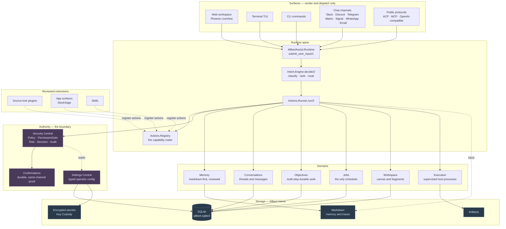
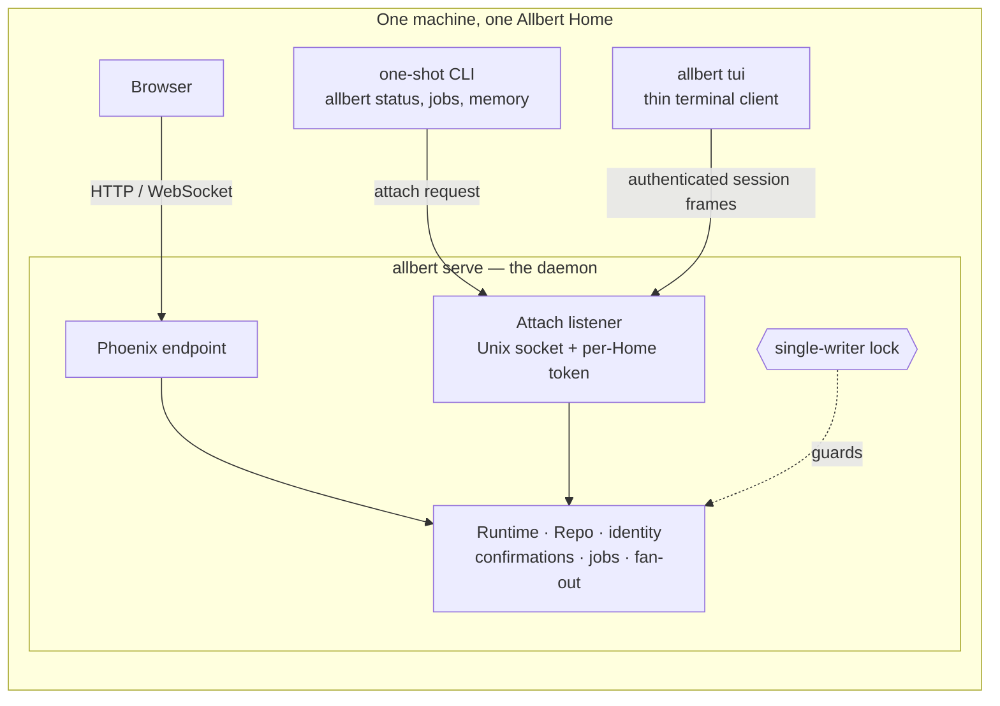
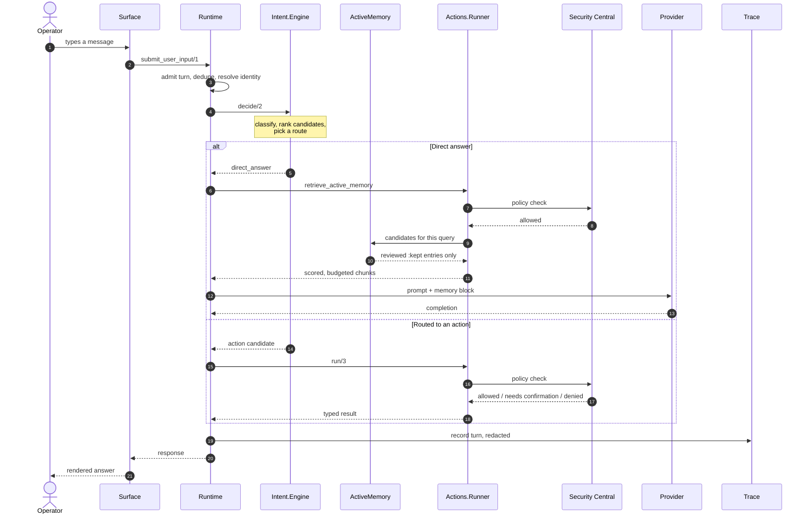
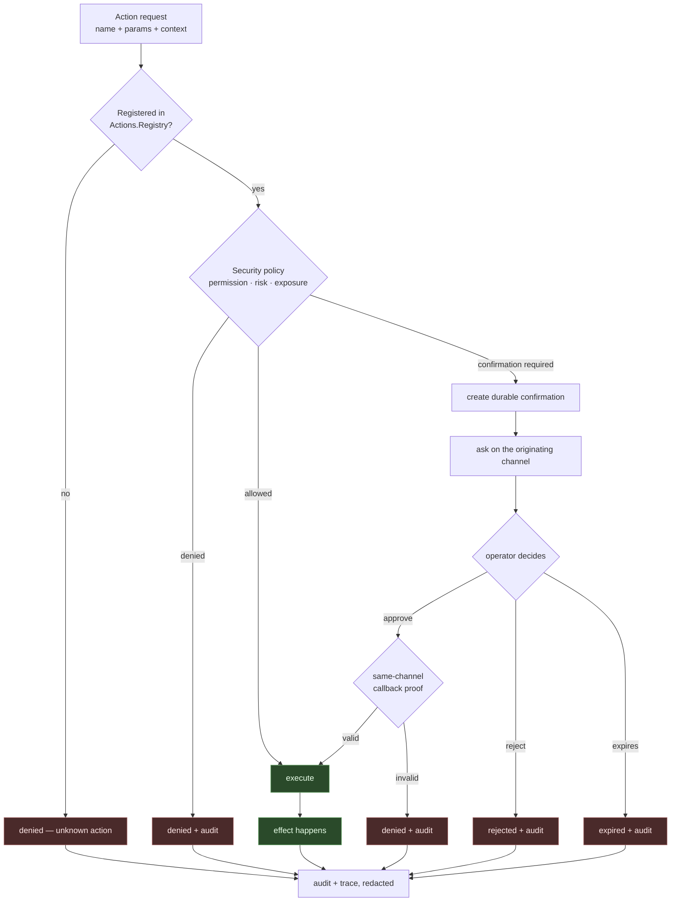
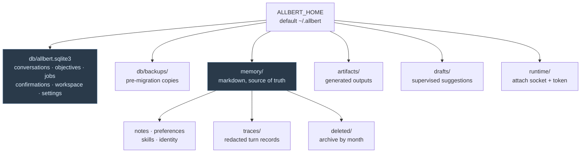
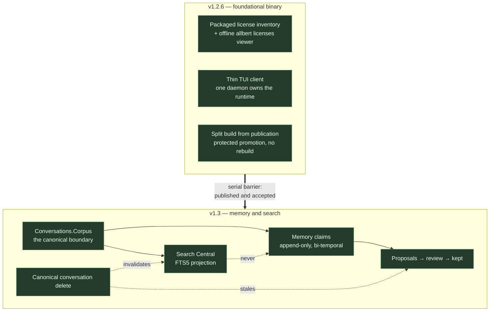

# Allbert Architecture Diagrams

Visual orientation for the current implementation line, verified against the
code rather than inferred from plans. The final section is the in-flight
release-train map; use the active plan for milestone landing and release status.

Diagrams are Mermaid and render natively on GitHub. When a diagram and the code
disagree, the code wins — these are orientation aids, not contracts. The binding
contracts live in the [ADRs](../adr/README.md), and the subsystem routing map
for deeper work is
[agent-context-map](../developer/agent-context-map.md).

Two ideas explain most of the layout below. First, **every surface goes through
one runtime**: asking from the browser and asking from the terminal produce the
same authority decisions. Second, **authority comes from registered actions,
settings, policy checks, and confirmations** — never from model output, plugin
metadata, YAML, or a surface being the one that asked.

---

## 1. Component map

The whole system, from surfaces down to storage. Everything in the Surfaces row
adapts input and renders output; none of it decides what is allowed.

The arrow that matters most is the dotted one from **Reviewed extensions** into
the registry. A plugin, app, or skill does not gain capability by existing; it
registers actions, and those actions are subject to exactly the same policy and
confirmation checks as built-in ones.

---

## 2. One process, many surfaces

The packaged product runs a single daemon per Allbert Home. A writer lock makes
that structural rather than advisory: a second process that tries to boot
against the same Home refuses instead of becoming a competing SQLite writer.

ADR 0091 makes `allbert tui` a thin authenticated client of the same daemon.
The daemon owns Runtime and durable session state; the client owns terminal
input, rendering, resize, and restoration. Web and one TUI can therefore remain
open concurrently against one Home without a second Repo or writer.

---

## 3. A chat turn, end to end

What actually happens between typing and an answer. This is the direct-answer
path — the one that consults memory.

Two details are load-bearing. Memory candidates are filtered to
operator-reviewed `:kept` entries **before** scoring, so an unreviewed note
cannot reach a prompt by ranking well. And the trace is written after the fact
through the redactor, so secrets never land in the record of what happened.

---

## 4. The authority boundary

Every effect takes this path. There is no side door for plugins, apps, model
output, or a surface that "already knows" the operator approved something.

The **same-channel callback proof** is the part people miss: approving in Slack
authorizes the thing that was asked in Slack. An approval cannot be replayed
from a different surface, and possession of a confirmation id is not authority.

---

## 5. Supervision tree

The OTP shape, which is also the failure-isolation story. Optional children
start based on mode and settings — a one-shot CLI invocation starts far less
than a daemon.

```mermaid
flowchart TD
    SUP["AllbertAssist.Supervisor<br/>one_for_one"]

    SUP --> REPO["Repo"]
    SUP --> WLOCK["writer lock<br/>serve mode only"]
    SUP --> PUBSUB["Phoenix.PubSub"]
    SUP --> BUS["Jido.Signal.Bus"]
    SUP --> SETSUP["Settings.Supervisor"]
    SUP --> TASKS["Task.Supervisor"]

    SUP --> EXECREG["Execution.ProcessRegistry"]
    SUP --> EXECOWN["Execution.ProcessOwners"]

    SUP --> OBJREG["Objectives.AgentRegistry"]
    SUP --> OBJSUP["Objectives.Runs.Supervisor"]
    SUP --> OBJSCHED["Objectives.Runs.Scheduler"]

    SUP --> ROUTIDX["Intent.Router.Index"]
    SUP --> ROUTPEND["Intent.Router.PendingStore"]

    SUP --> JIDO["Jido"]
    SUP --> GC["Artifacts.GC"]
    SUP --> RATE["PublicProtocol.RateLimiter"]
    SUP --> SWEEP["PublicProtocol.ResultReadbackSweeper"]

    SUP -.optional.-> PLUGSUP["Plugin.Supervisor"]
    SUP -.optional.-> APPSUP["App.Supervisor"]
    SUP -.optional.-> DYNSUP["DynamicPlugins.Supervisor"]
    SUP -.optional.-> JIDOSUP["JidoBacked.Supervisor"]
    SUP -.optional.-> SCRATCH["Session.Scratchpad<br/>volatile ETS"]
    SUP -.optional.-> CHANSUP["Channels.Supervisor"]
    SUP -.optional.-> ATTACHSRV["Attach.Server"]

    classDef opt stroke-dasharray: 4 4
    class PLUGSUP,APPSUP,DYNSUP,JIDOSUP,SCRATCH,CHANSUP,ATTACHSRV opt
```

`Execution.ProcessOwners` is worth naming: host processes Allbert spawns are
owned and supervised, so a crashed turn does not orphan a child process. OTP
supervision is failure isolation, not an OS security boundary — host execution
is bounded by policy, not by the process tree.

---

## 6. Allbert Home

All durable operator data lives under one directory, which is what makes
"delete this folder and Allbert is gone" true.

Markdown is authority for memory; SQLite is authority for everything
relational. Backups are taken before schema migrations, and a boot that cannot
write a backup refuses to migrate rather than proceeding unprotected.

---

## 7. Where v1.2.6 and v1.3 landed

Both stages are shipped: v1.2.6 delivered the thin client and packaged license
seams, and v1.3.0 delivered Memory and Search Central. See the
[archived v1.3 plan](../plans/archives/v1.3-plan.md), ADR 0091, ADR 0092, and
ADR 0093.

The crossed-out edge is deliberate: Search never feeds Memory. Being able to
*find* a message does not make it eligible to become a remembered fact about the
operator — those are separate grants with separate consent, and there is no
promote-to-memory path from a search result.

Two acts that look similar are kept distinct. **Forget** removes what Allbert
concluded and leaves the conversation; **canonical delete** removes what was
said. Each disclosure names the other as the further step.

---

## Keeping these honest

These diagrams are orientation, and orientation rots. When a subsystem moves,
update the diagram in the same change or delete it — a confidently wrong diagram
costs more than no diagram. The ADRs, the active plan triad, and the code remain
the authority in that order.
