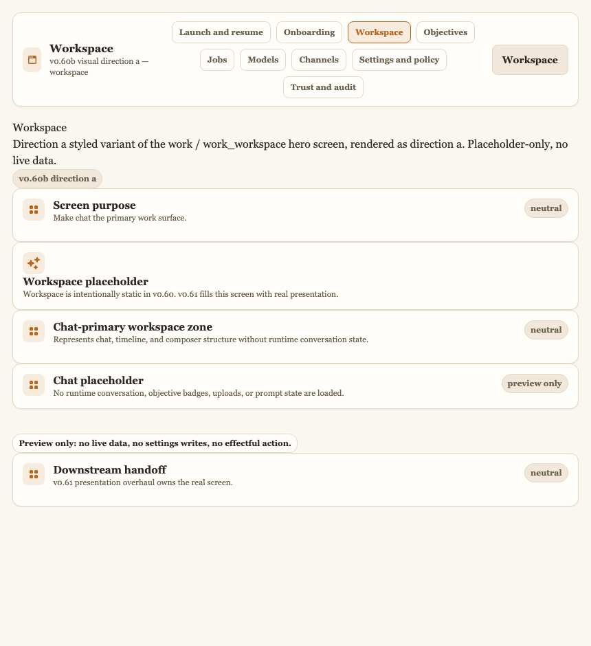

# Visual Direction A — Warm Editorial Calm

Status: v0.60b M3 candidate design direction (1 of ≥3). This is one of the divergent
visual languages the operator evaluates and chooses among in M5 (S4.5). It is
**design + disposable exploration**: v0.60b adds no runtime authority, no Settings key,
no capability. The rendered proof lives behind the `:preview_routes` flag at
`/preview/visual/a/{workspace,onboarding,trust,launch}` and reads no business state.

Source cluster: M1 mood/direction inventory **Direction cluster A — Warm Editorial
Calm** (references: Claude, editorial/reading-first products). Brief: satisfies all six
must-satisfy requirements in `docs/design/visual-language-brief.md`.

Rendered hero screens (design record): see
[`visual-directions/`](visual-directions/README.md) for all four captures of this
direction. Workspace hero:



## One-line character

A calm, humanist, document-like surface that reads "think here" — warm neutral
surfaces, a serif type voice, airy density, and slow, gentle motion. The technical
prosumer gets a legible, unhurried reading environment rather than a dense console.

## Stage 1 — Wireframe (structural placement)

Low-fidelity placement of the four hero screens, drawn before color/UI treatment.
Direction A's placement signature: **generous margins, a single centered reading
column, and a quiet, recessed left rail** — the chat/reading surface dominates and
chrome is pushed to the edges.

### `workspace` (chat-primary hero)

```text
+--------------------------------------------------------------+
|  ▚ Allbert            Workspace · Jobs · Trust · Settings     |  <- quiet top appbar
+------+-------------------------------------------------------+
|      |                                                       |
| nav  |            [ conversation transcript ]                |  <- centered reading
| (thin|              wide line-length, airy                   |     column, big margins
|  rail|                                                       |
|  icon|            [ assistant turn ]                         |
|  s)  |            [ operator turn   ]                         |
|      |                                                       |
|      |     +-------------------------------------------+     |
|      |     | composer (rounded, roomy)                 |     |  <- composer floats,
|      |     +-------------------------------------------+     |     generous padding
+------+-------------------------------------------------------+
```

### `onboarding`

```text
+--------------------------------------------------------------+
|  ▚ Allbert            Onboarding                              |
+--------------------------------------------------------------+
|                                                              |
|            Welcome — let's reach first useful chat            |  <- large serif title,
|            calm supporting sentence                          |     centered, lots of air
|                                                              |
|            ( QuickStart )   ( Advanced )                     |  <- two calm choice cards
|                                                              |
|            [ model path status · placeholder ]               |
|            [ review checkpoint · placeholder ]               |
+--------------------------------------------------------------+
```

### `trust`

```text
+--------------------------------------------------------------+
|  ▚ Allbert            Trust                                   |
+------+-------------------------------------------------------+
| nav  |   Authority posture (calm, reassuring)                |
|      |   +-----------------+  +------------------+            |
|      |   | trace (inert)   |  | confirmation     |            |  <- evidence cards in a
|      |   +-----------------+  +------------------+            |     relaxed 2-up grid
|      |   +---------------------------------------+            |
|      |   | approval placeholder                  |            |
|      |   +---------------------------------------+            |
+------+-------------------------------------------------------+
```

### `launch`

```text
+--------------------------------------------------------------+
|                                                              |
|                  ▚  Allbert                                   |  <- centered wordmark,
|             a calm local-first assistant                     |     editorial hero
|                                                              |
|                 ( Start )   ( Resume )                       |  <- start action zone
|                                                              |
|          local · no authority granted · private              |  <- quiet trust line
+--------------------------------------------------------------+
```

## Stage 2 — Styled scheme (color / UX / UI)

### Wireframe / placement scheme

Centered single reading column with wide margins; the left nav is a thin, recessed
icon rail that never competes with content. Elevation is expressed through **gentle
surface-tone steps and soft hairlines**, not drop-shadow. Responsive posture: on
narrow viewports the rail collapses to the mobile shellbar and the reading column goes
full-width, preserving the airy margins.

### Color scheme

Warm-neutral palette; surfaces read like paper. Dark mode keeps the warmth (warm
near-black rather than cool slate). High-contrast is left entirely to the a11y axis.

| Token | Light | Dark |
|---|---|---|
| `--allbert-surface-0` | `#faf6f0` | `#1b1712` |
| `--allbert-surface-1` | `#fffdf9` | `#241f18` |
| `--allbert-surface-2` | `#f1e8db` | `#2f2820` |
| `--allbert-text-strong` | `#2c2620` | `#f4ecdd` |
| `--allbert-text-soft` | `#6b5f4d` | `#b9ab94` |
| `--allbert-line` | `#e3d7c5` | `#3d352a` |
| `--allbert-accent` (terracotta) | `#b5651d` | `#dd9257` |
| `--allbert-accent-soft` | `#f6ebdd` | `#33291d` |

### Type

Humanist **serif** voice: `--allbert-font-family: ui-serif, Georgia, "Iowan Old
Style", "Palatino Linotype", "Book Antiqua", serif` (system-local, no web-font fetch).
Generous line-height for reading rhythm; the serif signals "editorial, considered."

### Spacing / density

Airy — `--allbert-density: 1.15` (loosens the gap/padding multiplier). Comfortable
white space around the reading column and composer.

### Motion character

Calm and slow — `--allbert-motion-duration-fast/base/slow: 160/220/320ms`, gentle
ease `cubic-bezier(0.25, 0.1, 0.25, 1)`. No spring, no overshoot. Collapses under
`data-reduce-motion` (the axis forces ~0ms transitions with `!important`).

### UX scheme

Reading-first, calm interaction. Navigation is a quiet rail; the composer is the
primary affordance and is always in reach. Affordance honesty: suggestions are inert
text cards, effectful actions are visually distinct and confirmation-gated (none are
wired in the preview). Trust affordances (provider/model status, authority-not-granted,
trace availability) sit as calm inline cards, not alarms. Keyboard and pointer are
equal citizens; nothing is urgency-driven.

### UI scheme

Soft, rounded-but-restrained components: `--allbert-radius-panel: 0.75rem`,
`--allbert-radius-control: 0.5rem`. Borders are soft warm hairlines; depth via
surface-tone steps. Iconography register: simple, line-weight, unobtrusive.

### Chat-primary hero composition

The `workspace` centers a wide, airy conversation column with a floating rounded
composer. Chat is unambiguously the hero; nav and status recede to the edges. It reads
like a calm writing surface — the operator's attention lands on the conversation.

## Token / variant delta (over the v0.58 substrate)

Expressed as the `[data-visual-direction="a"]` blocks in
`apps/allbert_assist_web/assets/css/app.css`:

- **Structural (contrast-safe, unconditional):** `--allbert-font-family` (serif),
  `--allbert-radius-{control,panel,modal,drawer}` + `--allbert-radius`,
  `--allbert-density: 1.15`, `--allbert-motion-duration-{fast,base,slow}`,
  `--allbert-motion-ease-standard`.
- **Color (guarded by `body:not([data-high-contrast="true"])` so high-contrast wins):**
  the surface / text / line / accent values above, with a separate
  `[data-theme="dark"] …` block for the dark palette.

No new rendering mechanism, no new catalog atom: the same
`Skeleton.PreviewLive.preview_surface/1` hero compositions render through the catalog
under this delta.

## Rubric self-assessment (M4 scores authoritatively)

- **Fit to IA/journey/persona/trust:** strong — calm, legible, trust affordances read
  as reassurance. Risk: can feel under-powered for a keyboard-first prosumer.
- **Feels 1.0 / ultra-modern:** strong editorial-modern (Claude-tier), distinctive.
- **Implementability:** clean small delta; matches the M1 token-delta shape directly.
- **A11y across axes:** holds — structural tokens are contrast-safe; colors yield to
  the high-contrast axis; motion collapses under reduced-motion.
- **Performance / local-first:** system-local serif, no heavy assets, no blur — cheap.
