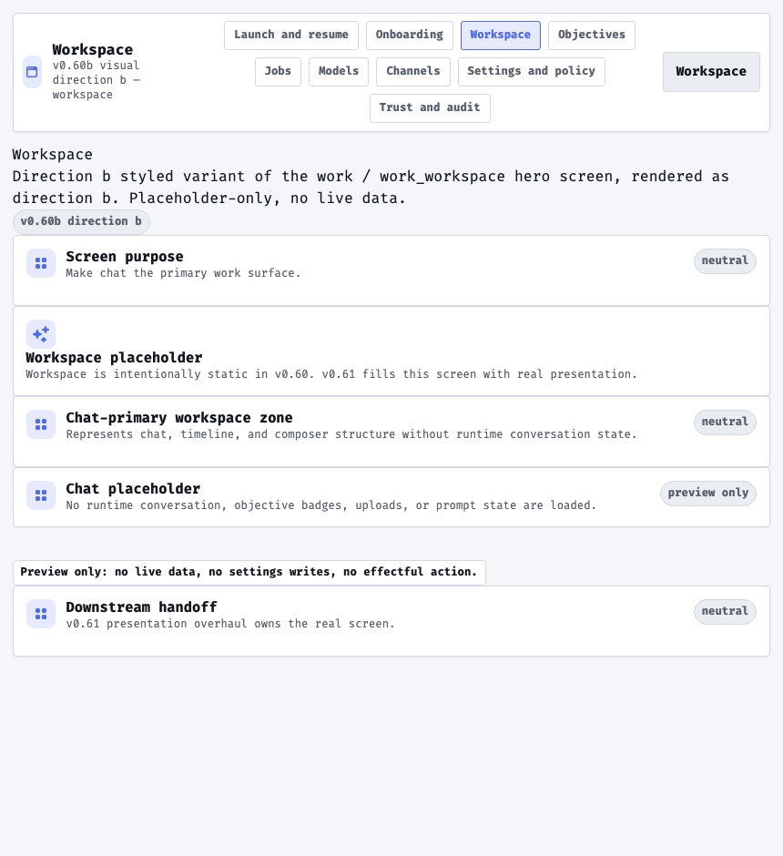

# Visual Direction B — Precise Technical Console

Status: v0.60b M3 candidate design direction (2 of ≥3). This is one of the divergent
visual languages the operator evaluates and chooses among in M5 (S4.5). It is
**design + disposable exploration**: v0.60b adds no runtime authority, no Settings key,
no capability. The rendered proof lives behind the `:preview_routes` flag at
`/preview/visual/b/{workspace,onboarding,trust,launch}` and reads no business state.

Source cluster: M1 mood/direction inventory **Direction cluster B — Precise Technical
Console** (references: Linear, Warp, Zed, Raycast; Geist type). Brief: satisfies all
six must-satisfy requirements in `docs/design/visual-language-brief.md`. This is the
**closest match to the technical-prosumer persona** and the deliberate opposite of the
"enterprise-grey utilitarian flat" trap the current v0.60 skeleton falls into.

Rendered hero screens (design record): see
[`visual-directions/`](visual-directions/README.md) for all four captures of this
direction. Workspace hero:



## One-line character

A precise, keyboard-native console: monospace type, cool-neutral surfaces, crisp
indigo accent, compact-but-scannable density, tight radii, and fast, purposeful
micro-motion. Reads as a serious operator tool.

## Stage 1 — Wireframe (structural placement)

Low-fidelity placement of the four hero screens, drawn before color/UI treatment.
Direction B's placement signature: **a dense, full-bleed three-zone console** — a
persistent grouped left nav, a primary work column, and a right status/utility rail
that is always visible. Nothing floats; everything is docked and gridded.

### `workspace` (chat-primary hero)

```text
+--------------------------------------------------------------+
| ▐ allbert  work ▸ workspace           ⌘K  status ● local     |  <- dense command bar
+-------+----------------------------------------+-------------+
| START |  transcript (full-width, tight rows)   |  UTILITY    |
| WORK  |  > operator turn                        |  model ●    |  <- right rail always
|  ›ws  |  assistant turn                         |  trace ○    |     docked (status)
| OPER  |  operator turn                          |  authority: |
| EXTEND|                                         |   none      |
| TRUST |----------------------------------------|             |
|       | > _ composer (inline, mono, tight)     |             |  <- inline docked
+-------+----------------------------------------+-------------+
```

### `onboarding`

```text
+--------------------------------------------------------------+
| ▐ allbert  onboarding                                         |
+-------+------------------------------------------------------+
| steps |  [1] provider   [2] model   [3] review               |  <- stepper, tight
|  ▸1   |  ----------------------------------------------------|
|   2   |  QuickStart (assisted-local)   Advanced              |  <- two dense option rows
|   3   |  model path: placeholder                             |
|       |  review checkpoint: placeholder                      |
+-------+------------------------------------------------------+
```

### `trust`

```text
+--------------------------------------------------------------+
| ▐ allbert  trust                                             |
+-------+------------------------------------------------------+
| nav   | trace ▾            confirmation ▾      approval ▾     |  <- three dense columns,
|       | [ inert rows ]     [ inert rows ]      [ inert rows ] |     scan-oriented
|       | authority: none · no live data · policy: unchanged   |  <- status strip
+-------+------------------------------------------------------+
```

### `launch`

```text
+--------------------------------------------------------------+
| ▐ allbert                                                    |
+--------------------------------------------------------------+
| $ allbert                                                    |  <- console/prompt hero
|   local-first assistant · no authority granted               |
|                                                              |
|   [ start ]  [ resume ]        ⌘K to command                 |  <- keyboard-forward
+--------------------------------------------------------------+
```

## Stage 2 — Styled scheme (color / UX / UI)

### Wireframe / placement scheme

A docked three-zone console: grouped left nav (Start / Work / Operate / Extend /
Trust), a primary work column, and an always-visible right status/utility rail.
Full-bleed, gridded, nothing floats. Elevation is expressed almost entirely through
**1px cool hairlines and subtle surface-tone**, not shadow. Responsive posture: the
right rail collapses into a drawer below the breakpoint and the left nav becomes the
mobile shellbar; the grid stays tight.

### Color scheme

Cool-neutral palette, crisp and low-chroma; a single saturated indigo accent for
active/interactive state. Dark mode is a true developer-dark (near-black blue-grey).

| Token | Light | Dark |
|---|---|---|
| `--allbert-surface-0` | `#f5f6f9` | `#0d1117` |
| `--allbert-surface-1` | `#ffffff` | `#131923` |
| `--allbert-surface-2` | `#eaedf2` | `#1b2431` |
| `--allbert-text-strong` | `#12161d` | `#e8edf4` |
| `--allbert-text-soft` | `#59616e` | `#9aa6b5` |
| `--allbert-line` | `#d2d7e0` | `#2a3341` |
| `--allbert-accent` (indigo) | `#4f6bed` | `#8a9dff` |
| `--allbert-accent-soft` | `#e7eafc` | `#1c2740` |

### Type

**Monospace-forward** — `--allbert-font-family: ui-monospace, "SF Mono", "JetBrains
Mono", "Fira Code", "Roboto Mono", "Courier New", monospace` (system-local). The mono
voice across the whole surface is the direction's boldest identity signal: it reads as
a precise, technical instrument.

### Spacing / density

Compact — `--allbert-density: 0.85` (tightens the gap/padding multiplier) for
scan-dense daily-use rows, while staying legible. This is the "density that still
scans" bar from Linear/Zed.

### Motion character

Crisp and fast — `--allbert-motion-duration-fast/base/slow: 90/110/150ms`, sharp ease
`cubic-bezier(0.2, 0, 0, 1)`. Micro-motion clarifies state change instantly; no
decorative animation. Collapses under `data-reduce-motion`.

### UX scheme

Keyboard-native and command-forward (a `⌘K`-style affordance is implied in the
wireframe, not wired in the preview). Navigation is a persistent grouped rail; the
right status rail keeps provider/model/trace/authority posture always visible —
trust affordances are first-class and docked, not buried. Affordance honesty is sharp:
inert suggestions vs distinct, gated effectful actions (none wired in preview). Dense
rows favor scanning.

### UI scheme

Tight, crisp components: `--allbert-radius-panel: 0.25rem`, `--allbert-radius-control:
0.1875rem`. Borders are precise 1px cool hairlines; depth via tone, not shadow.
Iconography register: minimal, geometric, monoline. Controls read like precise
instrument affordances.

### Chat-primary hero composition

The `workspace` docks a full-width, tight transcript as the primary column with an
inline monospace composer at its base and an always-visible right status rail. Chat is
the hero *and* the operator can see model/trust posture without leaving it — the
console keeps context permanently in view.

## Token / variant delta (over the v0.58 substrate)

Expressed as the `[data-visual-direction="b"]` blocks in
`apps/allbert_assist_web/assets/css/app.css`:

- **Structural (contrast-safe, unconditional):** `--allbert-font-family` (monospace),
  `--allbert-radius-{control,panel,modal,drawer}` + `--allbert-radius`,
  `--allbert-density: 0.85`, `--allbert-motion-duration-{fast,base,slow}`,
  `--allbert-motion-ease-standard`.
- **Color (guarded by `body:not([data-high-contrast="true"])` so high-contrast wins):**
  the surface / text / line / accent values above, with a separate
  `[data-theme="dark"] …` block for the developer-dark palette.

No new rendering mechanism, no new catalog atom: the same
`Skeleton.PreviewLive.preview_surface/1` hero compositions render through the catalog
under this delta.

## Rubric self-assessment (M4 scores authoritatively)

- **Fit to IA/journey/persona/trust:** strongest persona match — credible, capable,
  scan-dense; trust affordances docked and always visible. Risk: can tip toward cold
  if the accent/warmth is too restrained.
- **Feels 1.0 / ultra-modern:** Linear/Warp-tier console craft; distinctly modern, the
  clearest departure from the current utilitarian skeleton.
- **Implementability:** clean small delta; matches the M1 token-delta shape directly.
- **A11y across axes:** holds — structural tokens contrast-safe; colors yield to the
  high-contrast axis; motion collapses under reduced-motion.
- **Performance / local-first:** system-local mono, no heavy assets, no blur — cheapest
  of the three.
