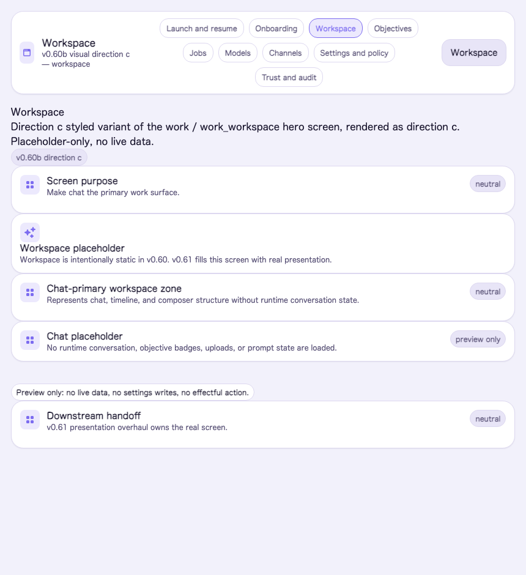

# Visual Direction C — Soft Modern Depth

Status: v0.60b M3 candidate design direction (3 of ≥3). This is one of the divergent
visual languages the operator evaluates and chooses among in M5 (S4.5). It is
**design + disposable exploration**: v0.60b adds no runtime authority, no Settings key,
no capability. The rendered proof lives behind the `:preview_routes` flag at
`/preview/visual/c/{workspace,onboarding,trust,launch}` and reads no business state.

Source cluster: M1 mood/direction inventory **Direction cluster C — Soft Modern
Depth** (references: Apple HIG material, Arc, Material 3 tonal elevation). Brief:
satisfies all six must-satisfy requirements in `docs/design/visual-language-brief.md`.
This is the **highest reward / highest risk** direction: the most distinctly "1.0
modern," but its depth/softness must stay disciplined to keep the a11y axes and state
honesty intact.

Rendered hero screens (design record): see
[`visual-directions/`](visual-directions/README.md) for all four captures of this
direction (the chosen language). Workspace hero:



## One-line character

A soft, dimensional, friendly-but-serious surface: rounded geometry, tonal violet
surfaces with gentle elevation, large radii, roomy density, and expressive-but-
controlled spatial motion. Warm and modern without becoming a toy.

## Stage 1 — Wireframe (structural placement)

Low-fidelity placement of the four hero screens, drawn before color/UI treatment.
Direction C's placement signature: **floating rounded cards on a tonal canvas** — the
layout is composed of soft, elevated panels with clear separation and breathing room,
rather than a docked grid or a single column.

### `workspace` (chat-primary hero)

```text
+--------------------------------------------------------------+
|   ◗ Allbert                              ●model  ○trace       |  <- pill appbar, floating
+---------+----------------------------------------------------+
|  ╭────╮ |   ╭──────────────────────────────────────────╮     |
|  │nav │ |   │  conversation card (elevated, rounded)     │     |  <- chat lives in a
|  │pill│ |   │   assistant turn (bubble)                  │     |     raised rounded card
|  │s   │ |   │   operator turn  (bubble)                  │     |
|  ╰────╯ |   ╰──────────────────────────────────────────╯     |
|         |   ╭──────────────────────────────────────────╮     |
|         |   │  composer (large radius, soft shadow)      │     |  <- floating composer
|         |   ╰──────────────────────────────────────────╯     |
+---------+----------------------------------------------------+
```

### `onboarding`

```text
+--------------------------------------------------------------+
|   ◗ Allbert   Onboarding                                      |
+--------------------------------------------------------------+
|        ╭────────────────────────────────────────────╮        |
|        │  Welcome ✦  (rounded hero card, elevated)    │        |  <- single soft hero
|        │  reach first useful chat                     │        |     card, centered
|        ╰────────────────────────────────────────────╯        |
|        ╭─ QuickStart ─╮   ╭─ Advanced ─╮                      |  <- pill choice cards
|        ╰──────────────╯   ╰────────────╯                      |
|        ╭ model path · placeholder ╮  ╭ review · placeholder ╮ |
+--------------------------------------------------------------+
```

### `trust`

```text
+--------------------------------------------------------------+
|   ◗ Allbert   Trust                                          |
+---------+----------------------------------------------------+
| nav     |  ╭ trace ╮   ╭ confirmation ╮                       |  <- soft rounded evidence
| pills   |  ╰───────╯   ╰──────────────╯                       |     cards, elevated,
|         |  ╭────────── approval placeholder ──────────╮       |     roomy gaps
|         |  ╰──────────────────────────────────────────╯       |
|         |  authority: none · local · no live data             |
+---------+----------------------------------------------------+
```

### `launch`

```text
+--------------------------------------------------------------+
|                                                              |
|              ◗                                                |  <- soft mark, floating
|          ╭────────────────────────────────╮                  |
|          │   Allbert                        │                 |  <- elevated hero card
|          │   your calm local assistant      │                 |
|          │   ( Start )      ( Resume )       │                 |  <- pill actions
|          ╰────────────────────────────────╯                  |
|              local · private · no authority                  |
+--------------------------------------------------------------+
```

## Stage 2 — Styled scheme (color / UX / UI)

### Wireframe / placement scheme

Floating rounded cards on a tonal canvas. Content is organized into soft, elevated
panels with clear separation and generous gaps; the primary chat lives in a raised
rounded card. Elevation is a **first-class tonal + gentle-shadow depth model** (the one
direction that leans into shadow), disciplined to preserve legibility. Responsive
posture: cards reflow to a single column below the breakpoint; radii and elevation
persist; the nav collapses to the mobile shellbar.

### Color scheme

Tonal violet-tinted neutrals with soft elevation; surface-1 stays near-white to lift
cards off the tinted canvas. Dark mode is a deep violet-charcoal.

| Token | Light | Dark |
|---|---|---|
| `--allbert-surface-0` (canvas) | `#f2f1fb` | `#14121f` |
| `--allbert-surface-1` (card) | `#ffffff` | `#1c1930` |
| `--allbert-surface-2` | `#e8e5f7` | `#251f3d` |
| `--allbert-text-strong` | `#1c1830` | `#efeafc` |
| `--allbert-text-soft` | `#5b5478` | `#b3a9d6` |
| `--allbert-line` | `#ddd8f0` | `#332c52` |
| `--allbert-accent` (violet) | `#7c6cf0` | `#a99bf7` |
| `--allbert-accent-soft` | `#ece9fd` | `#241d3d` |
| `--allbert-shadow-panel` | `0 18px 40px -12px rgb(60 40 120 / 28%)` | (inherits) |

### Type

Rounded geometric — `--allbert-font-family: ui-rounded, "SF Pro Rounded", "Hiragino
Maru Gothic ProN", "Quicksand", system-ui, sans-serif` (system-local, graceful fallback
to `system-ui`). Soft, friendly letterforms that pair with the rounded geometry.

### Spacing / density

Roomy — `--allbert-density: 1.1`, with large gaps between the floating cards so the
depth reads clearly. Slightly tighter than Direction A but with more elevation.

### Motion character

Spatial and expressive-but-controlled — `--allbert-motion-duration-fast/base/slow:
140/200/300ms`, ease `cubic-bezier(0.2, 0.8, 0.2, 1)`, with a gentle emphasis overshoot
`cubic-bezier(0.34, 1.4, 0.64, 1)` for card entrance. Motion follows spatial continuity
(cards rise/settle). **Fully collapses under `data-reduce-motion`** (the axis forces
~0ms with `!important`, so the overshoot never fires) — this is the direction's key
a11y discipline.

### UX scheme

Approachable and spatial. Navigation is soft nav pills; content is grouped into cards
the eye can parse at a glance. Trust affordances (model/trace/authority) sit as
distinct soft cards — visible and reassuring, never alarmist. Affordance honesty is
preserved by elevation and shape: inert suggestion cards vs distinct, gated effectful
actions (none wired in preview). Pointer-friendly, but keyboard focus order and focus
rings are preserved.

### UI scheme

Soft, dimensional components: `--allbert-radius-panel: 1.25rem`, `--allbert-radius-
control: 0.875rem` (large, pill-leaning). Depth via tonal surfaces **and** a disciplined
soft shadow (`--allbert-shadow-panel`). Iconography register: rounded, friendly,
slightly heavier weight. Controls are large, tactile, and clearly separated.

### Chat-primary hero composition

The `workspace` places the conversation inside a raised, rounded card floating on the
tonal canvas, with a soft floating composer beneath. Chat is the hero and feels
dimensional and inviting — the "warmest, most product-like" of the three heroes, at the
cost of the most rendering care (shadow/tone discipline).

## Token / variant delta (over the v0.58 substrate)

Expressed as the `[data-visual-direction="c"]` blocks in
`apps/allbert_assist_web/assets/css/app.css`:

- **Structural (contrast-safe, unconditional):** `--allbert-font-family` (rounded),
  `--allbert-radius-{control,panel,modal,drawer}` + `--allbert-radius`,
  `--allbert-density: 1.1`, `--allbert-motion-duration-{fast,base,slow}`,
  `--allbert-motion-ease-standard` + `--allbert-motion-ease-emphasis`,
  `--allbert-shadow-panel` (deepened, violet-tinted).
- **Color (guarded by `body:not([data-high-contrast="true"])` so high-contrast wins):**
  the surface / text / line / accent values above, with a separate
  `[data-theme="dark"] …` block for the deep violet-charcoal palette.

No new rendering mechanism, no new catalog atom: the same
`Skeleton.PreviewLive.preview_surface/1` hero compositions render through the catalog
under this delta.

## Rubric self-assessment (M4 scores authoritatively)

- **Fit to IA/journey/persona/trust:** moderate-strong — inviting and modern; trust
  affordances read as reassurance. Risk: softness can read less "operator instrument"
  than Direction B for a keyboard-first prosumer.
- **Feels 1.0 / ultra-modern:** highest ceiling — the most distinctly modern and
  distinctive; also the highest risk of tipping into novelty if undisciplined.
- **Implementability:** small delta but adds an elevation/shadow dimension; slightly
  more than A/B but still within the token-delta shape.
- **A11y across axes:** holds **if disciplined** — structural tokens contrast-safe;
  colors yield to the high-contrast axis; the overshoot motion must (and does) collapse
  under reduced-motion. This axis is the one to watch at S4.5.
- **Performance / local-first:** system-local rounded font; one soft box-shadow (cheap,
  no runtime blur across large surfaces) — acceptable local-first cost.
