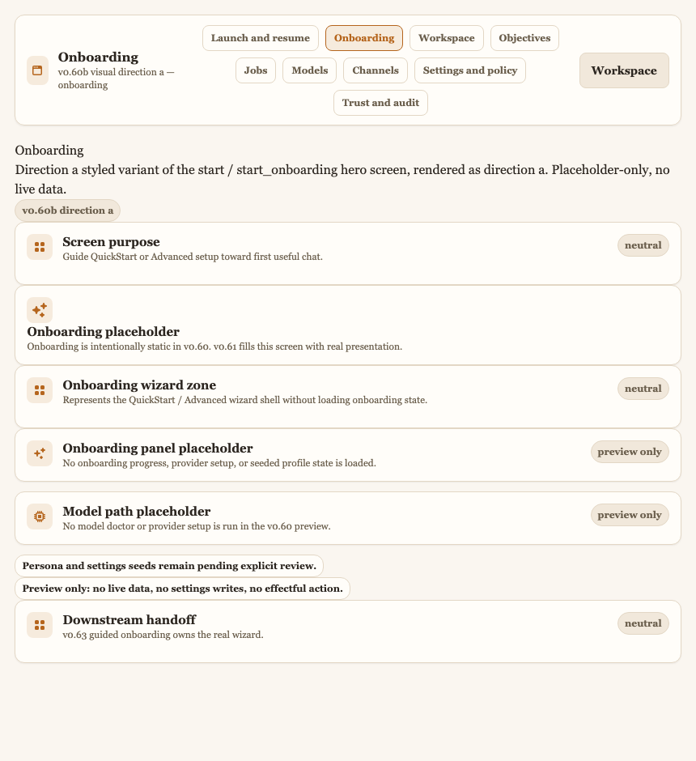
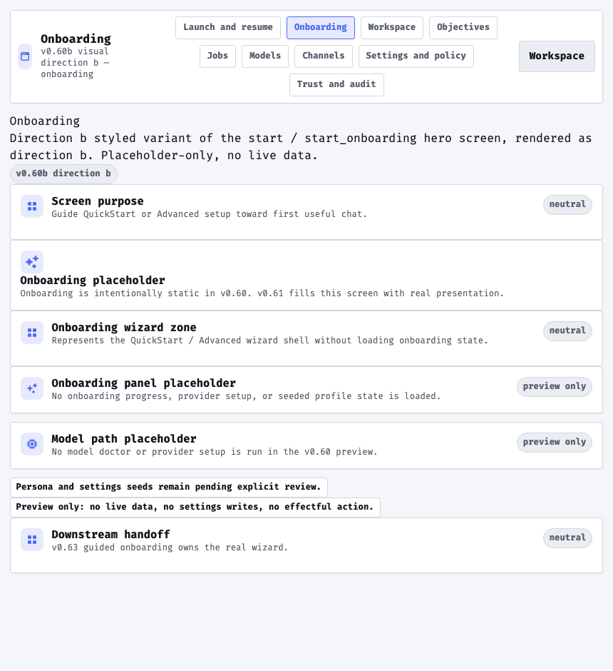
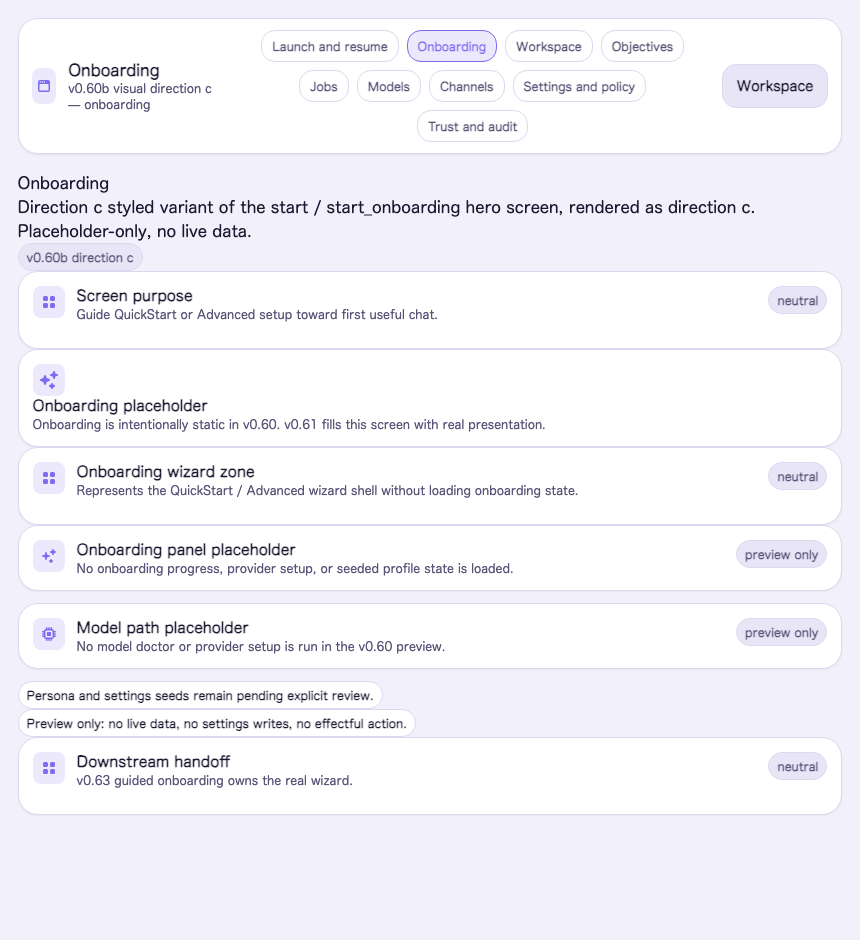
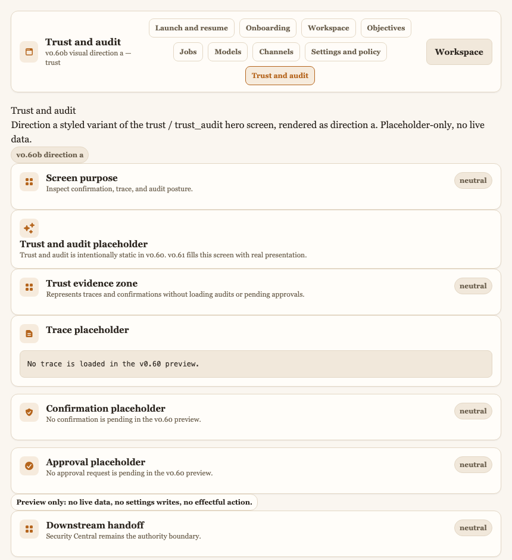
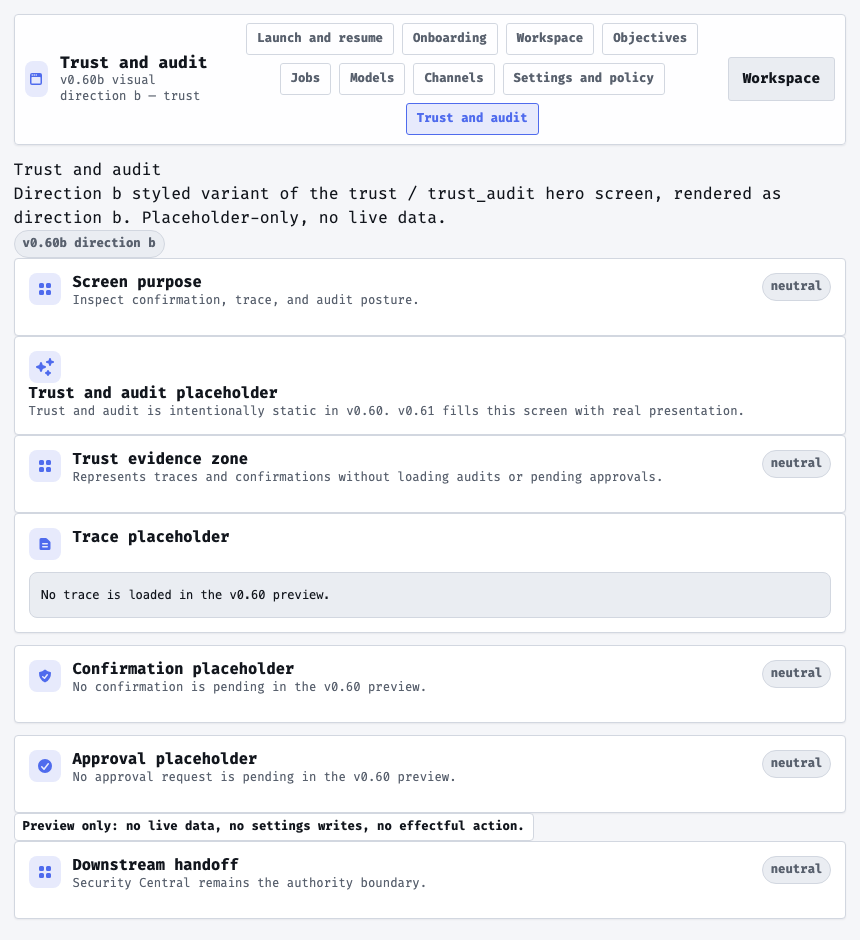
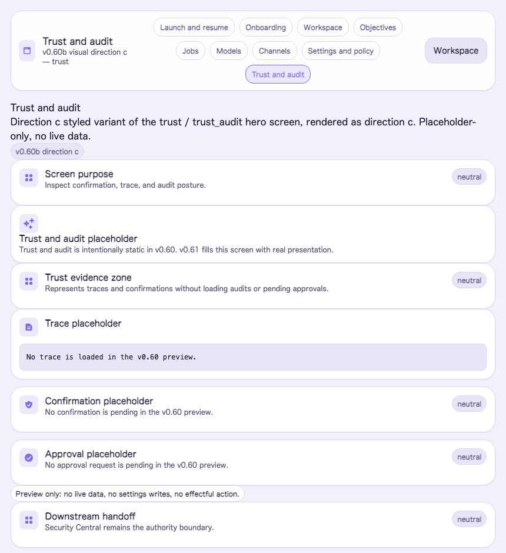
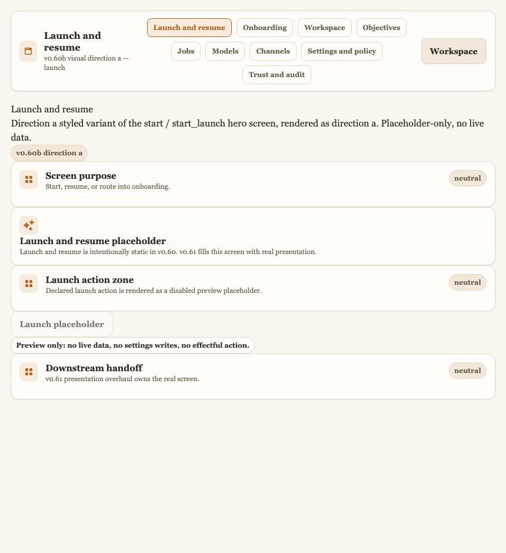
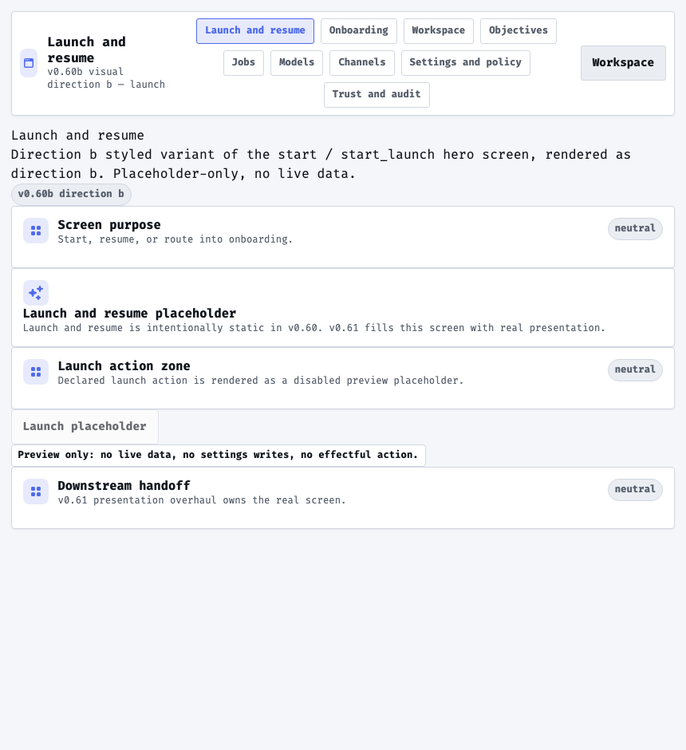
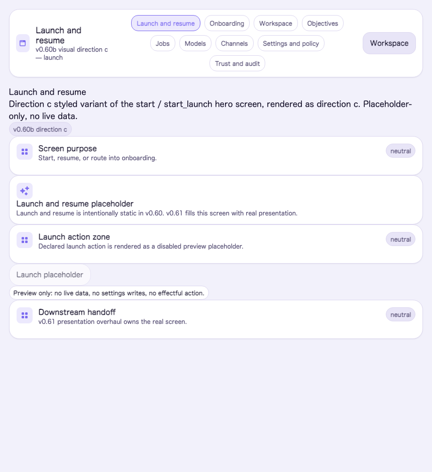
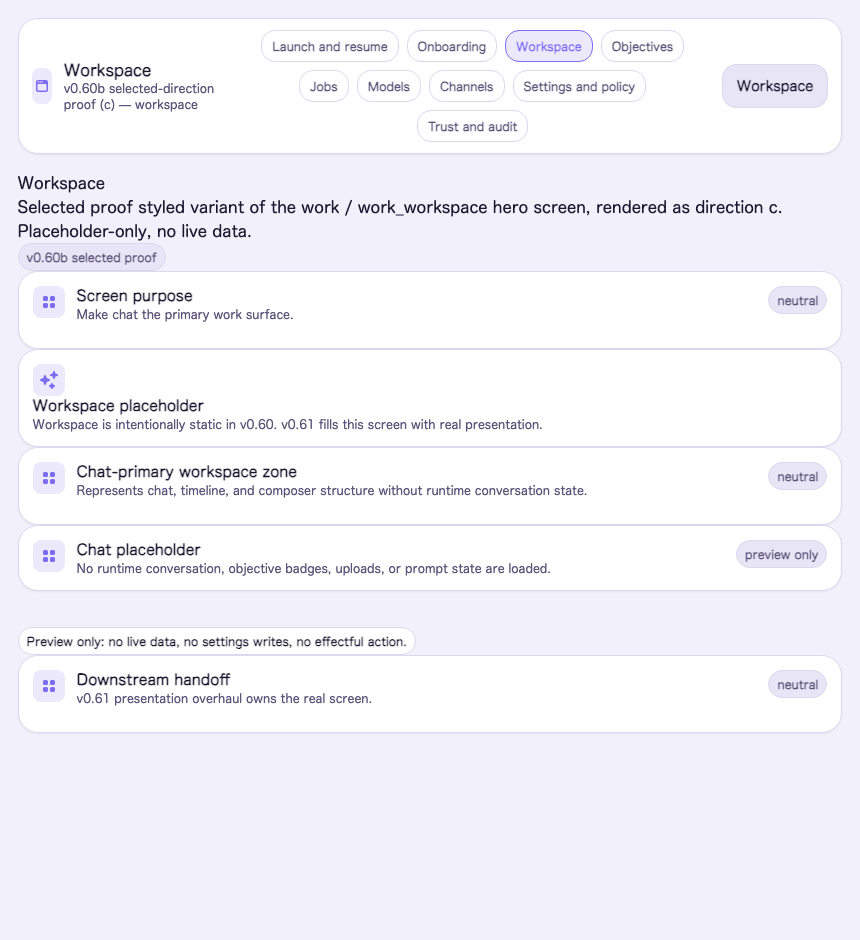

# v0.60b Rendered Hero Screens (design record)

Rendered captures of the three candidate visual directions and the selected-direction
proof, kept for posterity. These are the pixels the operator evaluated before choosing
**Direction C** in M5 (see `docs/design/visual-language-selected.md` and ADR 0079).

These are **placeholder-only** renderings of the disposable
`/preview/visual/<direction>/<screen>` styled variants (behind the `:preview_routes`
flag) — no live data, no authority, no business state. They are a design record, not
the S4.5 operator-validation evidence (that stays outside the repo per the request-flow).

Captured static-HTML (JS disabled) at 860px wide from the local preview server.

## Candidate directions

| Screen | A — Warm Editorial Calm | B — Precise Technical Console | C — Soft Modern Depth (chosen) |
|---|---|---|---|
| workspace |  |  |  |
| onboarding |  |  |  |
| trust |  |  |  |
| launch |  |  |  |

## Selected-direction proof (M6)

The chosen Direction C applied via the `/preview/visual/selected/*` proof route:

